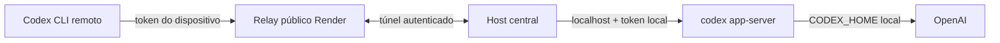

# Remote Codex app-server

Este repositório contém um relay experimental para usar o `codex app-server` da máquina central a partir de outro computador sem copiar o login ChatGPT/OpenAI.



O relay recebe somente tokens de dispositivos e seus hashes em memória. O host central mantém `CODEX_HOME`, executa `codex login` e abre uma conexão de saída para o relay. Se esse túnel cai, o relay entra em modo bloqueado e encerra os clientes.

O painel administrativo fica em [`/admin`](/admin). Ele usa Supabase Auth para owner/admin, permite operar várias contas ChatGPT isoladas no host central, acompanhar limites retornados pelo app-server e controlar dispositivos. O Supabase armazena somente metadados e snapshots; credenciais OpenAI nunca saem do host.

## Estado atual

Esta é uma implementação pessoal/experimental. O transporte remoto do app-server é experimental segundo a [documentação oficial do OpenAI](https://learn.chatgpt.com/docs/app-server), e o Render Free pode dormir ou reiniciar. O teste de aceitação ainda precisa ser feito com uma conta autenticada e dois computadores em redes diferentes.

## Desenvolvimento local

Requer Node.js 20 ou superior.

```powershell
npm.cmd install
npm.cmd run build
npm.cmd test
```

Para iniciar apenas o relay localmente, gere um segredo do túnel, calcule o SHA-256 e configure:

```powershell
$env:RELAY_AGENT_TOKEN_SHA256 = "HASH_SHA256_DO_SEGREDO_DO_HOST"
npm.cmd run relay
```

O relay serve a documentação em `http://localhost:10000/`, responde `/healthz` e só responde `/readyz` com sucesso depois que o host estiver registrado e sincronizado.

## Host central

Na máquina que contém o login:

```powershell
codex login
$env:RELAY_URL = "wss://SEU_RELAY.onrender.com"
$env:RELAY_AGENT_TOKEN = "SEGREDO_LONGO_DO_HOST"
npm.cmd run host
```

O script `host` carrega automaticamente o arquivo `.env` na raiz do projeto. Os nomes devem ser exatamente `RELAY_URL`, `RELAY_AGENT_TOKEN`, `SUPABASE_URL` e `SUPABASE_SECRET_KEY`; não é necessário repetir `$env:` no PowerShell.

Para gerar um novo segredo e o hash exigido pelo Render, no host central use `.\scripts\new-relay-agent-token.ps1`. O token bruto tem 43 caracteres base64url e fica somente no host; o valor SHA-256 hexadecimal tem 64 caracteres e vai em `RELAY_AGENT_TOKEN_SHA256` no Render. O script não grava arquivos.

Para a primeira configuração administrativa, aplique a migration em `supabase/migrations/`, crie o usuário owner no Supabase Auth e rode na máquina central:

```powershell
$env:SUPABASE_URL = "https://SEU_PROJETO.supabase.co"
$env:SUPABASE_SECRET_KEY = "SB_SECRET_SOMENTE_NO_HOST"
npm.cmd run admin -- bootstrap --email owner@example.com
```

Depois abra `https://SEU_RELAY.onrender.com/admin`. O host inicia um app-server por conta, cada um em seu próprio `CODEX_HOME`; novas contas podem ser adicionadas no painel e o login device-code é exibido ali.

Em outro computador, o token de dispositivo é usado somente para o relay:

```powershell
$env:CODEX_REMOTE_TOKEN = "TOKEN_DO_DISPOSITIVO"
codex --remote wss://SEU_RELAY.onrender.com:443 --remote-auth-token-env CODEX_REMOTE_TOKEN
```

O token do dispositivo não é um login OpenAI. Ele deve ser emitido, copiado uma única vez e revogado pelo host central:

```powershell
npm.cmd run access -- issue --label pc-notebook --ttl 30d
npm.cmd run access -- list
npm.cmd run access -- revoke device-XXXXXXXX
npm.cmd run access -- revoke-all
```

Veja o [guia de segurança](SECURITY.md) e as páginas em [`site/`](site/index.html) antes de expor o relay à internet.
