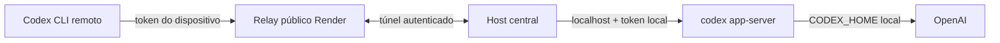

# Remote Codex app-server

Referência oficial do protocolo: [Codex app-server README](https://github.com/openai/codex/blob/main/codex-rs/app-server/README.md).

## Política e uso por dispositivo

Prefira o painel em `/admin` para emitir tokens administrativos ou operar contas. A emissão permite selecionar a conta e escolher a data de expiração. O painel também copia o token, a variável PowerShell ou o comando completo enquanto o modal de emissão estiver aberto; usuários comuns recebem o token automaticamente no dashboard quando sua janela começa.

Cada conta pode ter um token não revogado. `disable` é temporário; `revoke` é permanente e preserva o registro para auditoria, mas nunca permite reabilitação. O token revogado precisa ser substituído por uma nova emissão.

O host observa as notificações `thread/tokenUsage/updated` do app-server e registra por dispositivo os tokens de entrada, cache, saída e raciocínio observados. A janela de 300 minutos retornada por `account/rateLimits/read` controla a sessão e aparece para o usuário com percentual restante e próximo reset. A janela mais longa continua registrada para a visão administrativa semanal. Como os contadores pertencem à conta, uso direto na máquina central também aparece no consumo da sessão.

## Usuários e agendamento

O login unificado fica em `/login`: administradores entram com email e usuários comuns com o nome da equipe. A página `/dashboard` permite reservar uma sessão fixa de cinco horas, iniciada em um reset derivado da janela de 300 minutos da conta. A credencial do relay só pode ser emitida quando a reserva está ativa e expira automaticamente no fim desse ciclo.

Cada sessão recebe 100% da janela de cinco horas da conta, sem upgrade, downgrade ou divisão de quota. Cada pedido escolhe uma conta disponível e entra como `pending`; somente `owner` ou `admin` pode aprovar ou recusar. Ao entrar na janela aprovada, o dashboard emite o token real e bloqueia o acesso quando a quota curta é esgotada ou o ciclo termina.

Depois de aplicar a migration `codex_user_scheduling`, importe os logins do protótipo para usuários reais do Supabase Auth:

```powershell
npm.cmd run users -- import-legacy
```

O comando importa cada equipe do SQL como um grupo real, ignora o login de teste e aliases duplicados e atualiza as credenciais no Supabase Auth. O SQL legado e suas políticas públicas não são reativados.

Este repositório contém um relay experimental para usar o `codex app-server` da máquina central a partir de outro computador sem copiar o login ChatGPT/OpenAI.



O relay recebe somente tokens de dispositivos e seus hashes em memória. O host central mantém `CODEX_HOME`, executa `codex login` e abre uma conexão de saída para o relay. Se esse túnel cai, o relay entra em modo bloqueado e encerra os clientes.

O painel administrativo fica em [`/admin`](/admin) e exige uma sessão Supabase de owner/admin habilitado antes de renderizar a interface. Ele permite operar várias contas ChatGPT isoladas no host central, acompanhar limites retornados pelo app-server e controlar dispositivos. O botão **Adicionar conta** cria a conta no host e abre o OAuth real do Codex; depois do login, o painel consulta o app-server até a conta ficar pronta. O Supabase armazena somente metadados e snapshots; credenciais OpenAI nunca saem do host.

## Estado atual

Esta é uma implementação pessoal/experimental. O transporte remoto do app-server é experimental segundo a [documentação oficial do OpenAI](https://learn.chatgpt.com/docs/app-server), e o Render Free pode dormir ou reiniciar. O teste de aceitação ainda precisa ser feito com uma conta autenticada e dois computadores em redes diferentes.

## Desenvolvimento local

Requer Node.js 20 ou superior.

```powershell
npm.cmd install
npm.cmd run build
npm.cmd test
```

O frontend atual usa React com Vite em modo multipágina. As entradas são `web/login.html`, `web/dashboard.html`, `web/admin.html` e `web/groups.html`; o build gera somente o artefato publicado em `site/`, que não é versionado.

Para desenvolver a interface com hot reload, execute `npm.cmd run dev:web`. A saída de produção continua sendo servida pelo relay com `SITE_DIR=site`.

Para testar tudo em uma única máquina (relay, host-agent e os app-servers locais), configure o `.env` com o Supabase externo, `RELAY_AGENT_TOKEN` e o `codex` instalado/logado, depois execute:

```powershell
npm.cmd run local
```

O modo local separa automaticamente o ambiente do relay e do host: a secret do Supabase e o token bruto do túnel ficam somente no host. Antes de testar o fluxo de agendamento em um projeto Supabase existente, aplique todas as migrações pendentes de `supabase/migrations/`, incluindo `20260825210000_allow_immediate_partial_sessions.sql`.

Esse modo força o host a usar o relay local em `ws://127.0.0.1:10000/tunnel`, serve o site em `http://127.0.0.1:10000/` e mantém o Supabase como serviço externo. Encerre com `Ctrl+C`.

Para iniciar o local e o Tailscale Funnel juntos no Windows, use `start-local-tunnel.cmd` (ou `npm.cmd run local:tunnel`). O script espera o relay responder, configura `tailscale funnel --bg 10000`, captura a URL estável `*.ts.net` e abre o login nessa URL. O Tailscale precisa estar instalado, conectado à conta e com o Funnel habilitado; use `tailscale funnel off` para desativar a publicação. O dashboard gera o comando do Codex usando automaticamente o domínio da página atual.

Para iniciar apenas o relay localmente, gere um segredo do túnel, calcule o SHA-256 e configure:

```powershell
$env:RELAY_AGENT_TOKEN_SHA256 = "HASH_SHA256_DO_SEGREDO_DO_HOST"
npm.cmd run relay
```

O relay serve a documentação em `http://localhost:10000/`, responde `/healthz` e só responde `/readyz` com sucesso depois que o host estiver registrado e sincronizado.

## Host central

Na máquina que contém o login:

```powershell
codex login
$env:RELAY_URL = "wss://SEU_RELAY.onrender.com"
$env:RELAY_AGENT_TOKEN = "SEGREDO_LONGO_DO_HOST"
npm.cmd run host
```

O script `host` carrega automaticamente o arquivo `.env` na raiz do projeto. Os nomes devem ser exatamente `RELAY_URL`, `RELAY_AGENT_TOKEN`, `SUPABASE_URL` e `SUPABASE_SECRET_KEY`; não é necessário repetir `$env:` no PowerShell.

Para gerar um novo segredo e o hash exigido pelo Render, no host central use `.\scripts\new-relay-agent-token.ps1`. O token bruto tem 43 caracteres base64url e fica somente no host; o valor SHA-256 hexadecimal tem 64 caracteres e vai em `RELAY_AGENT_TOKEN_SHA256` no Render. O script não grava arquivos.

Para a primeira configuração administrativa, aplique a migration em `supabase/migrations/`, crie o usuário owner no Supabase Auth e rode na máquina central:

```powershell
$env:SUPABASE_URL = "https://SEU_PROJETO.supabase.co"
$env:SUPABASE_SECRET_KEY = "SB_SECRET_SOMENTE_NO_HOST"
npm.cmd run admin -- bootstrap --email owner@example.com
```

Para criar um login individual com senha forte aleatória (exibida uma única vez), execute um comando por pessoa. `--login` permite entrar com um nome curto, sem expor o e-mail interno do Supabase Auth:

```powershell
npm.cmd run admin -- create --login professor --role owner
npm.cmd run admin -- create --login raissa --role admin
```

Somente `owner` visualiza telemetria; `owner` e `admin` podem revisar pedidos, bloquear agendamentos de um grupo e revogar seu token ativo.

Depois abra `https://SEU_RELAY.onrender.com/admin`. O host inicia um app-server por conta, cada um em seu próprio `CODEX_HOME`; novas contas podem ser adicionadas no painel e o login device-code é exibido ali.

Em outro computador, o token de dispositivo é usado somente para o relay:

```powershell
$env:CODEX_REMOTE_TOKEN = "TOKEN_DO_DISPOSITIVO"
codex --remote wss://SEU_RELAY.onrender.com:443 --remote-auth-token-env CODEX_REMOTE_TOKEN
```

O Codex App usa o fluxo SSH oficial. Durante uma sessão ativa, selecione **Codex App** no dashboard, baixe a chave Ed25519 temporária e copie a entrada gerada para `~/.ssh/config`. O host inicia `codex app-server` com o `CODEX_HOME` da conta reservada; a chave pública é removida ao desabilitar, revogar ou expirar a sessão.

O token do dispositivo não é um login OpenAI. Ele deve ser emitido, copiado uma única vez e revogado pelo host central:

```powershell
npm.cmd run access -- issue --label pc-notebook --ttl 30d
npm.cmd run access -- list
npm.cmd run access -- revoke device-XXXXXXXX
npm.cmd run access -- revoke-all
```

Veja o [guia de segurança](SECURITY.md) e o frontend em [`web/`](web/) antes de expor o relay à internet.
